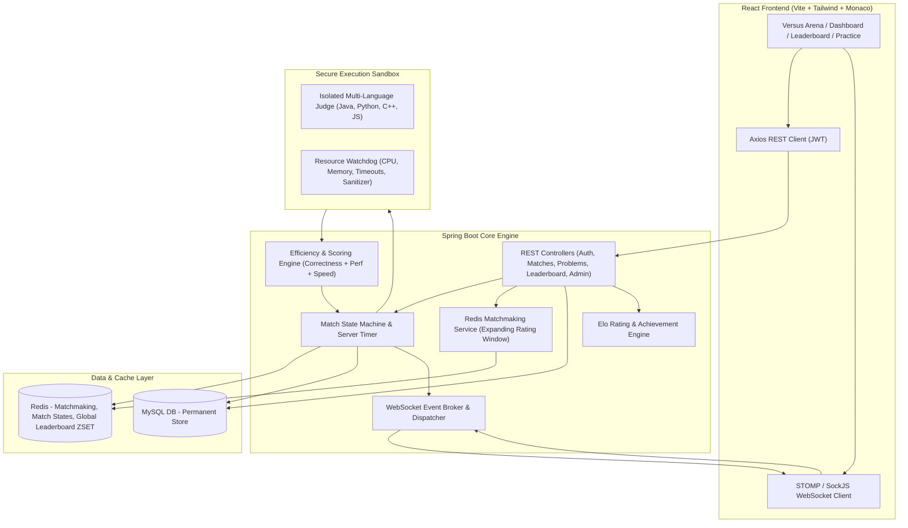

# Implementation Plan - CodeDuel: Real-Time 1v1 Competitive Programming Platform

CodeDuel is a full-stack, real-time 1v1 competitive coding platform inspired by modern competitive versus experiences. Two players face off on identical coding problems under a server-authoritative timer, submit code evaluated by an isolated judging service, and are ranked based on **Correctness → Execution Efficiency (70%) + Memory (30%) → Submission Speed**, driving standard Elo rating updates, leaderboards, and post-match deep analytics.

---

## User Review Required

> [!IMPORTANT]
> The platform includes an initial **1,000-problem curated DSA question bank** (CD-0001 through CD-1000) structured with metadata, difficulty tiers (~250 Easy, ~550 Medium, ~200 Hard), topics, patterns, constraints, and test cases, seeded automatically on startup via `ProblemSeeder`.

> [!NOTE]
> Database & Cache configuration: Default configuration connects to MySQL (`localhost:3306`) and Redis (`localhost:6379`), with automatic fallback / embedded database resilience for local development and Docker orchestration (`docker-compose.yml` included).

---

## Architecture & System Design

---

## Proposed Changes

### 1. Project Initialization & Architecture Setup
Create the monorepo root structure containing:
- `backend/`: Spring Boot 3 / Java 17 Maven project.
- `frontend/`: React 18 / Vite / Tailwind CSS / Monaco Editor application.
- `docker-compose.yml` & `.env.example`: Full stack containerization (Backend, Frontend, MySQL, Redis).

---

### 2. Backend Implementation (Spring Boot)

#### Config & Security
- `com.codeduel.config.SecurityConfig`: Spring Security 6 filter chain, stateless JWT auth, BCrypt password encoder, CORS.
- `com.codeduel.config.JwtTokenProvider` & `JwtAuthenticationFilter`: Token issue, verification, claims extraction.
- `com.codeduel.config.WebSocketConfig`: STOMP over SockJS endpoint (`/ws`), message broker (`/topic`, `/queue`), user destination prefix (`/user`).
- `com.codeduel.config.RedisConfig`: Connection factory, `RedisTemplate`, `StringRedisTemplate`, Pub/Sub listeners.

#### Models & Entities (`com.codeduel.model`)
- `User`: ID, username, email, passwordHash, role (`USER`, `ADMIN`), rating (default 1200), wins, losses, draws, matchesPlayed, winStreak, bestWinStreak, globalRank, timestamps.
- `Problem`: ID (`CD-0001` to `CD-1000`), title, slug, difficulty (`EASY`, `MEDIUM`, `HARD`), topics (JSON/List), patterns, description, constraints, examples (JSON), inputFormat, outputFormat, timeLimitMs, memoryLimitMb, expectedTimeComplexity, expectedSpaceComplexity, source, externalUrl, starterCode (JSON map by language), isActive.
- `TestCase`: ID, problem, inputData, expectedOutput, isHidden, explanation, orderIndex.
- `Match`: ID, problem, status (`WAITING`, `MATCHED`, `COUNTDOWN`, `ACTIVE`, `PLAYER_SUBMITTED`, `JUDGING`, `COMPLETED`, `CANCELLED`, `EXPIRED`), mode (`SCORE`, `CLASSIC`, `SUDDEN_DEATH`), startTime, endTime, timeLimitSeconds, winnerId, isDraw.
- `MatchPlayer`: ID, match, user, submission, status (`CODING`, `RUNNING`, `SUBMITTED`, `ACCEPTED`, `WRONG_ANSWER`, `TLE`, `MLE`, `DISCONNECTED`), score, efficiencyScore, executionTimeMs, memoryUsageMb, submissionTimeSeconds, eloChange.
- `Submission`: ID, user, match, problem, language (`JAVA`, `PYTHON`, `CPP`, `JAVASCRIPT`), sourceCode, status, executionTimeMs, memoryUsageMb, testsPassed, totalTests, efficiencyScore, outputSummary, submittedAt.
- `RatingHistory`: ID, user, match, oldRating, newRating, ratingChange, opponentRating, createdAt.
- `UserProblemHistory`: ID, user, problem, match, status, solvedAt.
- `Achievement` & `UserAchievement`: Badges, requirements, unlockedAt.
- `Notification`: ID, user, title, message, type, isRead, createdAt.

#### Problem Bank (1,000 Curated Problems & Seeder)
- `com.codeduel.seed.ProblemSeeder`: Automatically parses and seeds 1,000 distinct, high-quality DSA questions with full metadata, starter code for 4 languages, sample + hidden test cases, topic/pattern categorization across:
  - Arrays & Hashing (120)
  - Two Pointers & Sliding Window (80)
  - Binary Search (70)
  - Strings (70)
  - Linked List (60)
  - Stack & Monotonic Stack (60)
  - Queue & Deque (30)
  - Trees & BST (100)
  - Heap / Priority Queue (50)
  - Greedy (60)
  - Backtracking (40)
  - Graphs & DSU (120)
  - Dynamic Programming (130)
  - Bit Manipulation (40)
  - Trie (20)
  - Advanced DS / Algorithms (50)
- `com.codeduel.service.ProblemProvider`: Pluggable abstraction (`LocalProblemProvider` and `ExternalProblemProvider`).

#### Matchmaking Engine (`com.codeduel.service.MatchmakingService`)
- Redis Sorted Set / Queue with expanding rating search:
  - 0-10 sec: $\pm 50$ rating
  - 10-20 sec: $\pm 100$ rating
  - 20-30 sec: $\pm 200$ rating
  - 30+ sec: Broad range
- Deduplication, self-match prevention, stale ticket cleanup, cancellation support.
- Problem Selection: Automatically picks appropriate difficulty based on players' average rating ($\le 1200$: Easy, $1200-1600$: Easy/Medium, $1600-2000$: Medium, $2000+$: Medium/Hard) filtered by unplayed problems via `UserProblemHistory`.

#### Match Lifecycle & Server Authoritative Timer (`com.codeduel.service.MatchService`)
- State machine: `MATCHED` $\to$ `COUNTDOWN` (3s) $\to$ `ACTIVE` (15m) $\to$ `JUDGING` $\to$ `COMPLETED`.
- Server timestamp source-of-truth (`startTime`, `endTime`, `remainingSeconds`).
- Reconnection / Disconnection grace period (30 seconds) handling without immediate forfeiture.
- Winner determination logic:
  1. Correctness (Accepted vs non-accepted)
  2. Score Mode: Efficiency Score ($70\%$ Runtime $+ 30\%$ Memory) $+$ Submission Speed
  3. Classic / Sudden Death: First accepted solution with efficiency tie-breaker
  4. Server-side timestamp verification

#### Secure Judging Engine & Execution Sandbox (`com.codeduel.judge.*`)
- `ExecutionSandbox`: Isolated subprocess runner with CPU, execution timeout (1-2s), memory caps, working directory sandboxing, and output truncation.
- Supported languages: Java, Python 3, C++, JavaScript (Node.js).
- `EfficiencyEngine`: Normalizes runtime against expected problem complexity and test execution benchmarks on a 0-100 curve with jitter tolerance ($102\text{ms}$ vs $105\text{ms}$ yields no unfair penalty).
- `ComplexityEstimator`: Pattern & AST heuristics for advisory time/space complexity analysis.

#### Elo Rating & Leaderboard Service
- `EloRatingService`: Standard Elo rating formula $R' = R + K \cdot (S - E)$ where $E = \frac{1}{1 + 10^{(R_{opp} - R)/400}}$.
- `LeaderboardService`: Redis Sorted Set `leaderboard:global` for $O(\log N)$ real-time rank querying, percentile calculation, and MySQL persistence.

---

### 3. Frontend Implementation (React + Vite + Tailwind + Monaco)

- **Design System**: Dark modern competitive gaming theme (Cyberpunk / Modern NeetCode dark palette: slate/zinc `#090d16`, neon cyan `#06b6d4`, electric violet `#8b5cf6`, victory emerald `#10b981`, defeat crimson `#ef4444`).
- **Core Pages & Routes**:
  - `/`: Landing page with live battle preview and feature highlights.
  - `/login` & `/register`: Clean auth cards with instant validation.
  - `/dashboard`: Player stats card (Rating, Global Rank, Win Rate, Streaks), quick action buttons (`Find Match`, `Practice`, `Leaderboard`, `History`), recent match ticker.
  - `/versus`: Matchmaking radar UI showing search status, elapsed time, expanding rating range, topic/difficulty filter selector, cancel button.
  - `/versus/:matchId`: The 1v1 Battle Arena:
    - **Left Column**: Problem statement, constraints, examples, topic tags, link to external reference.
    - **Center Column**: Monaco Editor with syntax highlighting, language selector (Java, Python, C++, JS), draft auto-save, Run Code / Submit Code buttons, Test Case runner console.
    - **Right Column**: Opponent Live Card showing live status badges (Coding, Running, Submitted, Tests passed $x/y$, Disconnected grace timer), Match Timer, Match Mode.
  - **Result Screen & Modal**: Dynamic VS victory/defeat fanfare, Elo rating gain/loss ticker, side-by-side efficiency/runtime/memory comparison bars, rematch request button.
  - `/practice`: 1,000 problem repository with search, topic filters, difficulty chips, solved/unsolved status, and dedicated practice solver (`/practice/:problemId`).
  - `/leaderboard`: Global rankings with tier badges (Grandmaster, Master, Diamond, Gold, Silver, Bronze), search player, win rates.
  - `/matches` & `/matches/:matchId`: Historical battle log and post-match deep analytics view.
  - `/profile`: Comprehensive analytics dashboard with rating progression graph, topic mastery radar, difficulty breakdown, achievement badges.
  - `/admin`: Admin dashboard with 1,000-question bank management, statistics, test case editor, and user controls.

---

### 4. Verification & Testing Plan

#### Automated & Build Verification
1. **Backend Build & Unit Tests**:
   - `mvn clean test` (Testing Elo calculations, Match state transitions, Scoring hierarchy, Problem filtering, Seeder integrity).
2. **Frontend Build**:
   - `npm run build` (Ensuring zero syntax, JSX, or bundling errors).
3. **End-to-End Simulation**:
   - Simulate two players matchmaking, entering a match, running code, submitting solutions, evaluating results, updating ratings and leaderboards.
   - Verify practice mode problem execution and filtering across the 1,000 questions.
   - Verify WebSocket event broadcasting and server-synced countdown timer.
